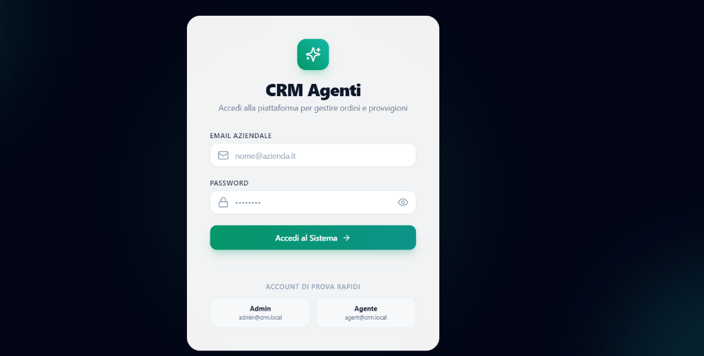

# 🏢 CRM Agenti & Provvigioni — Enterprise Monorepo

[](https://github.com/nicobada/crm-agenti/actions/workflows/ci.yml)

[](https://github.com/nicobada)


Piattaforma CRM B2B full-stack di livello enterprise per la gestione integrata della rete commerciale: anagrafica clienti conforme GDPR (Privacy by Design), ordini di vendita con movimentazione atomica del magazzino, motore provvigionale gerarchico multi-livello a regole concorrenti, archiviazione documentale ibrida S3/Locale e audit trail immutabile.

---

## ⚡ Live Demo & Preview

- 🌐 **Frontend Web App (Next.js su Vercel):** [https://crm-agenti-flax.vercel.app](https://crm-agenti-flax.vercel.app)
- ⚙️ **Backend REST API (NestJS su Render):** [https://crm-agenti-wyqe.onrender.com/api](https://crm-agenti-wyqe.onrender.com/api)
- 🗄️ **Database Cloud (PostgreSQL su Supabase):** Attivo in produzione con pooling e SSL

<p align="center">
  
</p>

---

## 🔐 Credenziali Demo (Seed Preconfigurato)

Il database di test locale include utenti preconfigurati con ruoli e visibilità differenziate:

| Ruolo | Email | Password | Accesso e Privilegi |
|---|---|---|---|
| **ADMIN / MANAGER** | `admin@crm.local` | `admin123` | Accesso completo: gestione agenti, cataloghi prodotti, approvazione e pagamento provvigioni, Audit Log GDPR |
| **AGENT** | `agent@crm.local` | `agent123` | Portale agente (`AGT-001`): creazione ordini, caricamento documenti, consultazione clienti e proprie provvigioni |

> Per il dettaglio completo della matrice dei permessi consulta [DEMO_CREDENTIALS.md](DEMO_CREDENTIALS.md).

---

## 🏗️ Architettura & Scelte Tecniche

Il progetto è strutturato come **Monorepo gestito con Turborepo**, garantendo separazione modulare tra frontend, backend e data layer, condivisione delle dipendenze e pipeline di build ottimizzate.

```
crm-agenti/
├── .github/workflows/    # CI/CD Pipeline (Lint, Typecheck, Test, Build)
├── apps/
│   ├── api/              # Backend REST con NestJS 10, Passport JWT, Multer
│   └── web/              # Frontend Dashboard con Next.js 14 (App Router) & Tailwind CSS
├── packages/
│   └── prisma/           # Data layer unificato: Schema Prisma, Migrazioni, Seed e Client
├── docker-compose.yml    # Infrastruttura locale containerizzata (PostgreSQL 16 + MinIO S3)
└── turbo.json            # Orchestrazione pipeline e task monorepo
```

### Perché questo stack?
- **NestJS 10 (Backend):** Architettura ad iniezione delle dipendenze, DTO con validazione automatica (`class-validator`), interceptor per audit log e exception filter centralizzati.
- **Next.js 14 App Router (Frontend):** Interfaccia moderna con Tailwind CSS, React Query (`@tanstack/react-query`) per la sincronizzazione ottimistica dello stato server e TanStack Table per reportistica ad alte prestazioni.
- **Prisma ORM & PostgreSQL 16:** Schema tipizzato end-to-end con migrazioni dichiarative e transazioni ACID (`$transaction`) per movimentazioni di magazzino e calcolo provvigioni.
- **Archiviazione Ibrida S3 / Locale:** Storage Service flessibile compatibile con AWS S3 / MinIO e fallback trasparente su filesystem locale per ambienti di sviluppo offline.

---

## 🧠 Business Logic & Algoritmi Chiave

### 1. Motore Provvigionale Gerarchico a Priorità
Il calcolo delle provvigioni (`CommissionCalculationService`) adotta un algoritmo di matching su base regole con priorità decrescente:
1. **Priorità 100 — Regola Prodotto:** Percentuale specifica definita sul singolo articolo dell'ordine.
2. **Priorità 80 — Regola Cliente:** Accordo contrattuale concordato con il cliente finale.
3. **Priorità 50 — Regola Agente:** Incentivo o aliquota target assegnata al singolo agente.
4. **Priorità 0 — Regola Globale:** Minimo garantito di fallback aziendale.
5. **Default — Aliquota Base Agente:** Aliquota standard registrata nell'anagrafica agente (`Agent.commissionRate`).

Include inoltre la gestione di soglie minime e massime di provvigione (`minAmount` / `maxAmount`) e report di calcolo con breakdown per singolo articolo.

### 2. Gestione Transazionale dello Stock
Quando lo stato di un ordine avanza a `CONFIRMED` o successivi, la disponibilità a magazzino degli articoli collegati viene scalata atomicamente all'interno di una transazione Prisma. In caso di annullamento (`CANCELLED`), le giacenze vengono ripristinate automaticamente.

### 3. Sicurezza RBAC & Data Ownership
Gli agenti commerciali hanno visibilità in lettura e scrittura esclusivamente sui propri ordini, documenti e provvigioni, garantita a livello di guardie HTTP NestJS (`JwtAuthGuard`, `RolesGuard`, `OwnershipGuard`) e a livello di filtri query Prisma nel service layer.

### 4. Conformità GDPR & Privacy by Design (Art. 17, 20, 25, 30)
L'architettura include controlli dedicati per adempiere al Regolamento Generale sulla Protezione dei Dati (UE 2016/679):
- **Portabilità dei Dati (Art. 20):** Esportazione immediata del dossier anagrafico e transazionale in formato standard machine-readable JSON (`GET /api/clients/:id/export`).
- **Diritto all'Oblio & Anonimizzazione PII (Art. 17):** Endpoint dedicato (`POST /api/clients/:id/anonymize`) che rimuove irreversibilmente ogni dato identificativo (nome, telefono, email, P.IVA, indirizzo) preservando la validità dello storico contabile ordini in ottemperanza all'Art. 17(3)(b) GDPR e all'obbligo di tenuta delle scritture contabili (art. 2220 C.C.). L'eliminazione fisica diretta viene bloccata a livello di servizio qualora sussistano ordini fiscali attivi.
- **Registro delle Attività di Trattamento (Art. 30):** Tracciamento automatico di tutte le mutazioni e degli accessi sensibili tramite `AuditInterceptor` e tabella `ActivityLog` (IP, User Agent, ID operatore, timestamp e payload sanitizzato privo di segreti o password).

---

## 🚀 Quickstart Locale (3 Passaggi)

### Prerequisiti
- **Node.js** 20+ e **npm** 10+
- **Docker** e Docker Compose

```bash
# 1. Clona il repository e installa le dipendenze
git clone https://github.com/nicobada/crm-agenti.git
cd crm-agenti
npm install

# 2. Configura le variabili d'ambiente e avvia il database
cp .env.example .env
docker compose up -d

# 3. Esegui le migrazioni, popola il database e avvia l'app
npm run db:migrate
npm run db:seed
npm run dev
```

- **Frontend Dashboard:** [http://localhost:3000](http://localhost:3000)
- **Backend API:** [http://localhost:3001/api](http://localhost:3001/api)
- **MinIO Console (Opzionale):** [http://localhost:9001](http://localhost:9001) (`minio` / `minio123`)

---

## 🧪 Test & Qualità del Codice

```bash
# Esegui typecheck su tutti i package del monorepo
npm run lint

# Esegui la suite di test unitari automatizzati
npm run test

# Verifica la build di produzione per tutti i package
npm run build
```

---

## 🛡️ API Reference Principale

| Metodo | Endpoint | Ruolo Richiesto | Descrizione |
|---|---|---|---|
| `POST` | `/api/auth/login` | Pubblico | Autenticazione e generazione JWT |
| `GET` | `/api/agents` | ADMIN, MANAGER | Elenco agenti con metriche di performance |
| `GET` | `/api/clients` | Tutti | Elenco clienti (filtrato per agente se ruolo AGENT) |
| `POST` | `/api/clients` | Tutti | Creazione anagrafica cliente |
| `GET` | `/api/clients/:id/export` | Tutti (Owner/Admin) | **GDPR Art. 20:** Esportazione portabilità dati JSON |
| `POST` | `/api/clients/:id/anonymize` | Tutti (Owner/Admin) | **GDPR Art. 17:** Anonimizzazione PII (Diritto all'Oblio) |
| `DELETE`| `/api/clients/:id` | Tutti (Owner/Admin) | Eliminazione anagrafica (bloccata se presenti ordini) |
| `POST` | `/api/orders` | Tutti | Creazione ordine e calcolo provvigioni |
| `PATCH`| `/api/orders/:id/status`| Tutti | Avanzamento stato ordine e aggiornamento stock |
| `GET` | `/api/commissions` | Tutti | Elenco provvigioni maturate |
| `PATCH`| `/api/commissions/:id/pay`| ADMIN, MANAGER | Liquidazione provvigione |
| `POST` | `/api/documents/upload` | Tutti | Upload documento su S3/Storage locale |
| `GET` | `/api/logs` | ADMIN | Consultazione Audit Log GDPR (Art. 30) |

---

## 💼 Servizi B2B, Personalizzazioni & Contatti

Questa piattaforma open source rappresenta un'architettura modulare di livello enterprise pronta per essere adattata a contesti commerciali specifici.

Sei un'azienda, un'agenzia o un system integrator e hai bisogno di:
- **Deployment Cloud Dedicato & Hardening:** configurazione di produzione isolata (AWS, GCP, Hetzner o VPS on-premise) con CI/CD e disaster recovery.
- **Integrazioni ERP & Sistemi Gestionali:** sincronizzazione bidirezionale con Zucchetti, TeamSystem, SAP, Danea Easyfatt, API di fatturazione elettronica SDI o cataloghi e-commerce.
- **Piani Provvigionali Personalizzati:** configurazione di algoritmi per ENASARCO, FIRR, premi a scaglioni progressivi, gare vendita e budget trimestrali.
- **Sviluppo Full-Stack & Consulenza Architetturale:** estensione delle funzionalità Next.js 14 / NestJS 10.

📬 **Sviluppatore & Contatto:** [@nicobada su GitHub](https://github.com/nicobada)  
*Disponibile per demo tecniche, audit di conformità e accordi di consulenza / sviluppo su misura.*

---

## 📄 Licenza

Rilasciato sotto licenza MIT.
